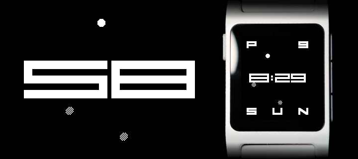

[Install on Rebble](https://apps.rebble.io/en_US/application/6912d087ad49bb00097251a0)

 

Fiftyeight tells the time, but it doesn't tell you what it should look like. Hate the analog clock? You can hide it. Figure the AM/PM indicator and date are useless? Replace them with a battery indicator and step counter. Fiftyeight lets you decide what matters most so that useful stuff is available at a glance.

Developed with the help of Cline via DeepSeek. Sprites, design, and architectural decisions by EuphoricPenguin.

Code available under MIT-0. Additional assets available under CC0. Neither requires attribution.
